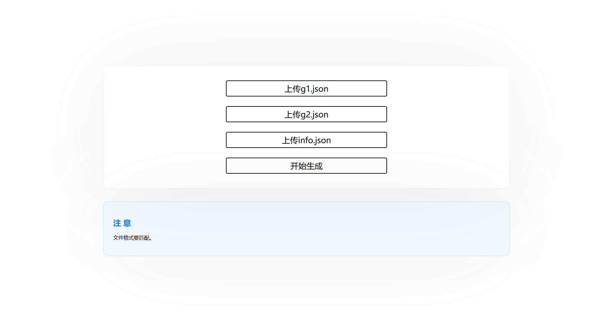
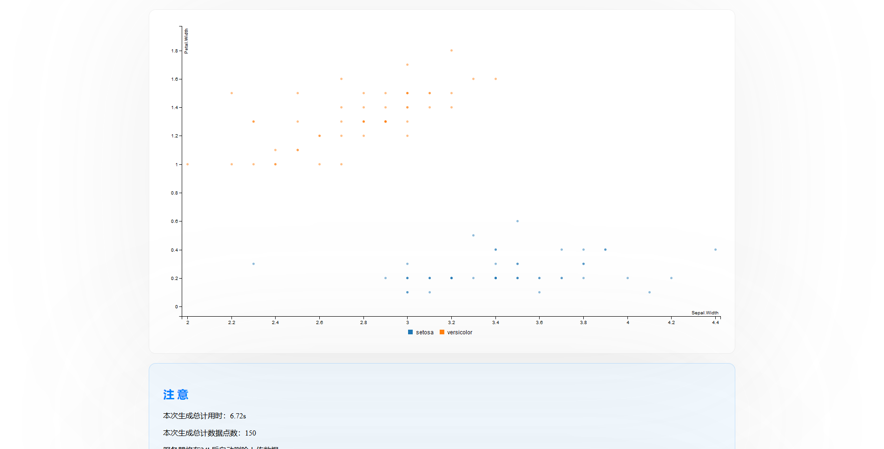

.. 伍泰炜 documentation master file, created by
   sphinx-quickstart on Fri Mar  8 21:36:09 2019.
   You can adapt this file completely to your liking, but it should at least
   contain the root `toctree` directive.
   you can visit my generated page via https://201736900125.readthedocs.io/zh_CN/latest/

散点图绘制器软件需求分析
##############################

目录
**********

.. toctree::
    :maxdepth: 2
    :numbered:
   index 

编辑历史
***********

==========  ======  ================================================  ======
   日期      版本                         说明                         作者
==========  ======  ================================================  ======
2019/03/05  v0.0.0  整理材料并梳理框架                                伍泰炜
2019/03/08  v0.0.1  起草目录并划分子标题                              伍泰炜
2019/03/13  v0.1.0  开始使用reSetructureText制作文档，熟悉语法        伍泰炜
2019/03/14  v0.1.1  梳理框架，开始第一部分的撰写，向老师汇报进度      伍泰炜
2019/03/15  v0.1.2  修改小标题，添加需求变更，继续写作                伍泰炜
2019/03/16  v0.1.3  继续写作，优先提高总体完成度，而不纠结于局部章节  伍泰炜
2019/03/19  v0.1.4  继续写作，修改细节上的小错误                      伍泰炜
2019/03/22  v0.1.5  继续写作，补充意外情况和需求变更                  伍泰炜
2019/03/26  v0.1.6  修正换行的小问题                                  伍泰炜
2019/03/27  v0.2.0  更新章节简介，放入第一版测试原型代码              伍泰炜
2019/04/08  v0.3.0  根据老师要求修改部分细节                          伍泰炜
==========  ======  ================================================  ======
//需求变更和意外情况就从其他版本归并

1 概览内容
**************

1.1 目标
==========
本文档是一个绘制散点矢量图的web应用软件程序。
它可以形象地显示两个基因在不同的生物实验条件下的基因表达情况，
并且能够表现两者的相关性。

该web应用的输入数据如下：
g1.json存储了某生物条件Ci下，基因g1的表达水平，i = 1,2,...,n，其中n是总的数据条目个数，
即g1基因的表达情况（比如蛋白产量）。
g2.json记录的内容与g1格式相同，但是是对另一个基因的测试结果
info.json存储了生物条件Ci的具体信息，如组织，环境等。

1.2 名词定义
==========

1.2.1 SPP
--------------
Scatter Plot Painter,SPP,散点图绘制器。 

1.3 章节简介
==========

本文此后的组织如下：

第二章是SPP的整体概述。
第三章讲具体需求，
第四五章对未来的使用做出部分预期和问题预案，
第六章具体地罗列了一些测试的流程，
第七章会放入部分测试数据。

2 整体概述
**************

2.1 产品透视
==========
整体上由用户数据，界面和Js程序组成，具体描述如下：

- 3个网页文件上传入口，分别上传横纵参数，以及细节信息的文件
- 简洁美观的用户交互页面，呈现良好的交互体验
- 利用Javascript程序接收前端文件，并处理解析
- 运用C3.js库，渲染数据生成可交互的矢量散点图

2.2 产品组成
==========

============  ============================
     UI                   内容
============  ============================
文件输入按钮  输入三个对应的文件，进行导入
图像生成按钮  点击生成图像
============  ============================

=========  ========================================
后端处理                     内容
=========  ========================================
数据转置   把导入的数据经行数组重置，以便于数据生成
C3.js框架  把处理好数据传给C3框架
=========  ========================================

2.3 用户特征
==========

2.3.1 学生
------------

学生在做一些课题项目的时候，有时候会有做数据呈现的需求。
他们（也包括笔者本人），会需要一个程序，可以直接输入数据，
然后在片刻内即可得到需要地矢量图象。
SSP可以在数据统计类的课题中能发挥尤为重要的功用。

2.3.2 研究人员
-------------------

研究人员和学生类似，但研究人员需要处理的数据量会更多，更庞大，更具有专业性
所以者对SPP的处理效率有了更进一步的需求。
本项目作为一个训练项目，SPP可能会在实现基本功能的基础上，对效率进行探索。

2.4 系统需求
==========
SPP是基于web的软件程序。笔者的计划是能够运行于chrome内核的谷歌浏览器以及火狐浏览器，并兼容win10系统。

3 具体需求
***************

3.1 功能性需求
==========

3.1.1 返回主界面
------------------

+---------------+------------------------------------------------+
| 功能需求[RQ1] | 一个按钮能够返回主界面                         |
+---------------+------------------------------------------------+
| 解决方案[RA1] | 在输出表格之后有必要设置一个按钮来返回输入界面 |
+---------------+------------------------------------------------+
| 测试情景[T1]  | 在对应的页面点击即可                           |
+---------------+------------------------------------------------+
| 重要性        | 高                                             |
+---------------+------------------------------------------------+

3.1.2 单点数据呈现
----------------------

+---------------+------------------------------------------------------------------------------+
| 功能需求[RQ2] | 鼠标放置数据点可以浮现数据                                                   |
+---------------+------------------------------------------------------------------------------+
| 需求原因[RA2] | 在数据量较小的时候，每个点的详细信息也很重要，所以需要展现出来。并且默认开启 |
+---------------+------------------------------------------------------------------------------+
| 测试情景[T2]  | 导入数据之后，尝试鼠标悬浮。若出现浮框，说明功能实现                         |
+---------------+------------------------------------------------------------------------------+
| 重要性        | 中                                                                           |
+---------------+------------------------------------------------------------------------------+

3.1.3 图例数据筛选
----------------------

+---------------+------------------------------------------------------------+
| 功能需求[RQ3] | 鼠标点击图例，可以显隐数据点                               |
+---------------+------------------------------------------------------------+
| 需求原因[RA2] | 用户需要又针对性地观察一些数据，对其进行筛选是必要的。     |
+---------------+------------------------------------------------------------+
| 测试情景[T3]  | 导入数据之后，尝试鼠标点击图例。若成功显隐，说明功能实现。 |
+---------------+------------------------------------------------------------+
| 重要性        | 高                                                         |
+---------------+------------------------------------------------------------+

3.1.4 数据分组标色
----------------------

+---------------+----------------------------------------------------------------------+
| 功能需求[RQ4] | 数据点按照信息分组并用不同颜色区分                                   |
+---------------+----------------------------------------------------------------------+
| 需求原因[RA2] | 数据点在信息中是属于某一个数据组的，对每一组的数据应该用一种颜色表明 |
+---------------+----------------------------------------------------------------------+
| 测试情景[T4]  | 导入数据后，查看颜色。若同一分组颜色相同，说明功能实现。             |
+---------------+----------------------------------------------------------------------+
| 重要性        | 高                                                                   |
+---------------+----------------------------------------------------------------------+

3.1.5 图例标签排序
--------------------------

+---------------+------------------------------------------------------------------+
| 功能需求[RQ5] | 数据的tissue图例标签按照名称排序                                 |
+---------------+------------------------------------------------------------------+
| 需求原因[RA3] | 数据较多的时候，找到标签会变得很困难，排序可以大大地优化用户查找 |
+---------------+------------------------------------------------------------------+
| 测试情景[T5]  | 导入数据后，查看图例标签。                                       |
+---------------+------------------------------------------------------------------+
| 重要性        | 低                                                               |
+---------------+------------------------------------------------------------------+

3.2 非功能性需求
=======================

3.2.1 响应时间
------------------------------

+---------------+---------------------------------------------------------------------------------------------------+
| 需求[RQ6] | 数据需要在10内给出一定响应                                                                        |
+---------------+---------------------------------------------------------------------------------------------------+
| 需求原因[RA4] | 用户在使用过程中，等待时间过长会降低使用体验。必须使数据处理时间在一个合理的范围之内。            |
+---------------+---------------------------------------------------------------------------------------------------+
| 测试情景[T6]  | 导入数据后，查看数据点变化。若在10秒内没有任何响应，说明SPP处理过慢。尤其要注意数据量较大的例子。 |
+---------------+---------------------------------------------------------------------------------------------------+
| 重要性        | 高                                                                                                |
+---------------+---------------------------------------------------------------------------------------------------+

3.2.2 数据安全 
--------------------

+---------------+----------------------------------------------------------------------------------------------------------------------------+
| 需求[RQ7]     | 上传的数据要在一定时间内销毁                                                                                               |
+---------------+----------------------------------------------------------------------------------------------------------------------------+
| 需求原因[RA5] | 有些用户对自己的数据有保密性的需求，所以上传过的数据要在有限时间内及时删除。此外，定期删除数据才可以保证服务器的正常运行。 |
+---------------+----------------------------------------------------------------------------------------------------------------------------+
| 测试情景[T7]  | 上传数据后，等待一定时间，观察服务器上数据是否删除                                                                         |
+---------------+----------------------------------------------------------------------------------------------------------------------------+
| 重要性        | 高                                                                                                                         |
+---------------+----------------------------------------------------------------------------------------------------------------------------+

3.2.3 处理时间预估 
-------------------------------

+---------------+--------------------------------------------------------------------------------+
| 需求[RQ8] | 上传数据后能给出预估的处理时间                                                 |
+---------------+--------------------------------------------------------------------------------+
| 需求原因[RA6] | 在较大的数据进入，如果给出一个处理时间的预期，能有效地优化用户的等待体验 |
+---------------+--------------------------------------------------------------------------------+
| 测试情景[T8]  | 上传数据后，查看页面是否会出现提示预估的时间。最好以进度条的形式呈现处理过程。 |
+---------------+--------------------------------------------------------------------------------+
| 重要性        | 低                                                                             |
+---------------+--------------------------------------------------------------------------------+

3.2.4 相关系数 correlation coefficient
----------------------------------------

+---------------+------------------------------------------------------------+
| 需求[RQ9]     | 相关系数                                                   |
+---------------+------------------------------------------------------------+
| 需求原因[RA7] | 虽然数据可视化了，但有精确的计算，才便于分析人员分析是结果 |
+---------------+------------------------------------------------------------+
| 测试情景[T9]  | 输入小测试数据，手算出相关系数，并与SPP的计算结果进行比较  |
+---------------+------------------------------------------------------------+
| 重要性        | 中                                                         |
+---------------+------------------------------------------------------------+

3.2.5 P值
-----------------------------------

+---------------+------------------------------------------------------------+
| 需求[RQ10] | 计算数据地P-value，并且以此为标准排序。                                                   |
+---------------+------------------------------------------------------------+
| 需求原因[RA8] |  对研究人员而言，p值可以更好地反应相关系数的意义 |
+---------------+------------------------------------------------------------+
| 测试情景[T10]  | 输入小测试数据，手算出P数值，并与SPP的计算结果进行比较  |
+---------------+------------------------------------------------------------+
| 重要性        | 中                                                         |
+---------------+------------------------------------------------------------+

3.2.6 保障尽可能多的数据点被使用
---------------------------------------------------

+---------------+----------------------------------------------------------------------------------+
| 需求[RQ11]    | 避免数据点的遗漏，尽可能多的绘制数据点                                           |
+---------------+----------------------------------------------------------------------------------+
| 需求原因[RA9] | 对研究人员而言，每个实验数据的结果都需要很大的投入，所以需要保证数据点能完全显示 |
+---------------+----------------------------------------------------------------------------------+
| 测试情景[T11] | 输入小测试数据，统计有多少个数据点在图中出现。                                   |
+---------------+----------------------------------------------------------------------------------+
| 重要性        | 高                                                                               |
+---------------+----------------------------------------------------------------------------------+

3.2.6 数据安全 
--------------------

+----------------+----------------------------------------------------------------------------------------------------------------------------+
| 需求[RQ12]     | 上传的数据要在一定时间内销毁                                                                                               |
+----------------+----------------------------------------------------------------------------------------------------------------------------+
| 需求原因[RA10] | 有些用户对自己的数据有保密性的需求，所以上传过的数据要在有限时间内及时删除。此外，定期删除数据才可以保证服务器的正常运行。 |
+----------------+----------------------------------------------------------------------------------------------------------------------------+
| 测试情景[T12]  | 上传数据后，等待一定时间，观察服务器上数据是否删除                                                                         |
+----------------+----------------------------------------------------------------------------------------------------------------------------+
| 重要性         | 高                                                                                                                         |
+----------------+----------------------------------------------------------------------------------------------------------------------------+

3.3 交互界面
==========

3.3.1 文件上传页面
----------------------

（以下的图片仅仅是初期的布局草图，并未实现相应功能）

本页面包含三个文件传输按钮，和一个启动按钮，在下方需要有提示信息，让用户知道使用的限制条件。

3.3.2 散点图呈现
----------------------

本页面呈现散点图，在注意栏目呈现需要生成过程的信息，在警告栏目呈现可能导致巨大偏差的信息。

3.3.3 用户操作选项
----------------------

.. image:: index3.png

在散点图下方，呈现了用户的功能选择条目，允许用户根据自己需求进行特定的操作。

4 需求变更
******************
在完成基本的需求之后，SPP应该还能有足够的自由度去应对需求变更的情况，有以下几种可能可能。

4.1 拓展通用性
===============

4.1.1 针对不同实验背景 
------------------------
脱离本课题的背景内容，SPP应该还可以用在其他背景下，分析数据的相关性比较。例如，人际关系匹配度的可视化比较，或者成绩相关性的可视化比较。
具体而言，对于一类功课成绩是否有相关性的课题讨论，比如英语成绩与人工智能成绩是否有相关性的分析，
可以按照每个人的分数单独输入，得出两门课的相关性。

比如在一些其他问题下，实验的分类形式就不是以tissue为标准的，所以对这种情况可能需要做一些兼容。

4.1.2 兼容更多环境
------------------------
在本题的背景下，内容主要是以win10系统，谷歌和火狐浏览器为环境开发的，
对于更多的环境，本软件有必要做一些兼容。

4.2 拓展实用性
===============

4.2.1 优化上传体验
------------------------
如果用户上传了三个文件，但是文件顺序错误了，需要有一定的判断，如果技术允许的话，甚至去实现不定序的上传。

4.2.2 优化程序体积
------------------------
最后应该把页面挂在上公网，那么ssp网页文件的体积就决定了在互联网上传输的效率，
为了给用户最佳体验，程序的体积应该尽可能地小。

5 意外情况
******************

5.1 服务器宕机
===============
主要表现：页面打开异常,或者无响应。

解决预案：及时重启服务器，保证网络通畅，检查异常发生原因。

5.2 文件格式不匹配
==================
主要表现：用户上传的文件可能会出现用户选错文件的情况，这会导致错误。。

解决预案：SPP的对口文件是.json数据文件，如果文件格式不匹配，可以给用户提示。

5.3 数据错乱
================

主要表现：用户上传的数据文件可能存在一定的不合理情况，比如对应的数据丢失甚至空白文件，或者info.json文件中的键值不是完全是tissue。

解决预案：要分情况讨论，对于上传的数据，存在大量的数据键值不匹配，比如超过70%的数据点无法呈现，应该在分析阶段就终止运行，给出反馈；
对于至少能呈现30%数据点的数据，可以考虑呈现可呈现的数据点，并给出警告，告知用户有百分之几的数据点无效，没有生效。

5.4 呈现出错
================
主要表现：可能存在无法预知的错误，导致数据呈现不正确

解决预案：及早发现问题并早日去分析问题发生的原因，并将其解决。

5.5 缺少info
================
有两种情况：
第一，如果用户没有上传info文件，那么本软件应该可以实现，默认其info都为unknown，并且呈现出相应的的散点图。
再这种情况下，散点图只有一种点，并且颜色相一致。

第二，如果用户上传了info文件，但是给g1，g2中存在一些点，他们的info是不存在的，那么也应该默认其info信息为
unknown。

6 测试用例
**************

6.1 基本功能
=======================

角色：用户

目标：输入正常数据，检查数据是否出错。

总览：用户现在上传三个符合背景的文件g1.json，g2.json和info.json，希望输出得到散点图，并查看两组基因的相关性。

主要步骤：

1. 用户选择对应的三个文件：g1.json，g2.json和info.json上传到软件应用中
#. 用户点击上传，服务器接受文件
#. 服务器传输数据，开始加载呈现散点图
#. 返回主页

备选步骤：

1. 用户移动光标，查看光标悬浮在点上，查看单点数据信息能否正常显示。
#. 点击图例查看是否有散点实现显影
#. 点击计算相关系数按钮，定量检验数据的相关性

6.2 处理意外
=====================

角色：用户

目标：输入异常数据数据，检查数据是否出错。

总览：用户现在上传三个不符合要求的文件，查看应用对意外情况的响应情况。

主要步骤：

1. 用户选择一些文件类型不是json的文件，检查服务器反馈，是否提出类型不匹配，然后返回。
#. 用户选择一些数据切合度较低的时候，查看服务器反馈，是否提出数据匹配度过低的问题，然后返回。
#. 用户选择一些数据量较大的文件上传，检查服务器反馈，是否提出单点数据被选择性略去。

6.3 数据检查测试
========================

角色：用户

目标：不对应地输入的数据，检查程序的反馈。

主要步骤：

1. 用户选择三个正确的文件，不对应地上传：比如g1.json放入info.json的入口
#. 点击确认，查看数据是否还合理。

备选步骤：

1. 再换一下提交顺序再尝试。
#. 结束。

7 测试数据
**************

小规模测试数据1
=====================

g1.json
{
    "R0001000014601": 1.38128181929635,
    "R0001000014602": 0.959350221334602,
    "R0001000014603": 1.30291275218084,
    "R0001000014604": 1.28923264827676,
    "R0001000014605": 1.34547236659964,
    "R0001000014606": 1.03318448334565
}

g2.json
{
    "R0001000014601": 3.14372115126744,
    "R0001000014602": 2.94021956362373,
    "R0001000014603": 2.79910893204918,
    "R0001000014604": 2.87525812008612,
    "R0001000014605": 3.27184770963431,
    "R0001000014606": 2.38508631450579
}

info.json
{
    "R0001000014601": {
        "tissue": "root",
        "detail": "what is what ..."
    },
    "R0001000014602": {
        "tissue": "root",
        "detail": "what is 00 what ..."
    },
    "R0001000014603": {
        "tissue": "bou",
        "detail": "wh00at is what ..."
    },
    "R0001000014604": {
        "tissue": "bou",
        "detail": "wh00000at is what ..."
    },
    "R0001000014605": {
        "tissue": "bou",
        "detail": "wh00000at is what ..."
    },
    "R0001000014606": {
        "tissue": "ddd",
        "detail": "wh00555110at is what ..."
    }
}

